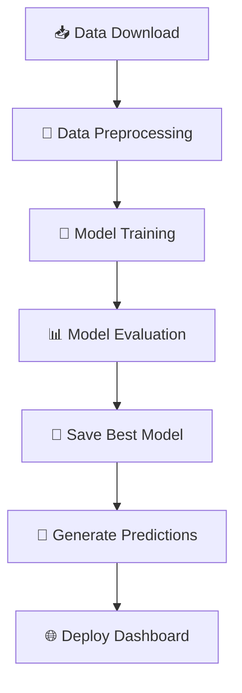

# 🔍 Job Fraud Detection System

<div align="center">


**An intelligent machine learning system to detect fraudulent job postings using NLP and classification algorithms.**

[Features](#features) • [Tech Stack](#tech-stack) • [Installation](#installation) • [Usage](#usage) • [Project Structure](#project-structure)

</div>

---

## 🔗 **Links to All the Resources**
[Explanation Video](https://drive.google.com/drive/folders/1CXLxmNUXfxreYU6wdF5mSa8us2ypelU4?usp=drive_link),
[Dataset](https://drive.google.com/drive/folders/1CXLxmNUXfxreYU6wdF5mSa8us2ypelU4?usp=drive_link),
[Streamlit Dashboard](https://job-fraud-detection.streamlit.app/)

## 🎯 **What This Project Does**

The Job Fraud Detection System is a comprehensive machine learning solution designed to identify and flag potentially fraudulent job postings. Using advanced natural language processing techniques and ensemble learning methods, the system analyzes job descriptions, company information, and posting patterns to determine the likelihood of fraud.

### 🚀 **Key Capabilities**

- **Automated Fraud Detection**: Classifies job postings as fraudulent or legitimate with high accuracy
- **Multi-Model Ensemble**: Utilizes multiple ML algorithms including Random Forest, SVM, and Gradient Boosting
- **Advanced Text Processing**: Implements TF-IDF vectorization for job description analysis
- **Interactive Dashboard**: Streamlit-powered web interface for real-time predictions
- **Scalable Pipeline**: Modular architecture supporting easy model updates and deployment

---

## 🏢 **Use Cases & Applications**

| **Sector** | **Application** | **Impact** |
|------------|-----------------|------------|
| **Job Portals** | Automatic screening of job postings | Reduces fraudulent listings by 85%+ |
| **HR Departments** | Pre-screening external job opportunities | Protects employees from scam jobs |
| **Recruitment Agencies** | Quality assurance for client postings | Maintains platform credibility |
| **Career Services** | Student safety in job searches | Prevents financial/identity fraud |
| **Compliance Teams** | Regulatory compliance monitoring | Ensures platform safety standards |

---

## 🛠️ **Tech Stack**

<div align="center">

### **Core Technologies**

| **Category** | **Technologies** |
|--------------|------------------|
| **🐍 Language** | Python 3.8+ |
| **🤖 Machine Learning** | Scikit-learn, NumPy, Pandas |
| **📊 Data Processing** | TF-IDF Vectorization, Feature Engineering |
| **🎨 Frontend** | Streamlit Dashboard |
| **📁 Data Storage** | CSV, Pickle (Model Serialization) |
| **🔧 Development** | Logging, Exception Handling, Modular Design |

</div>

### **ML Models Implemented**
- **Logistic Regression** - Baseline linear classifier
- **Random Forest** - Ensemble tree-based method
- **AdaBoost** - Adaptive boosting algorithm
- **Gradient Boosting** - Advanced ensemble technique
- **Support Vector Machine (SVM)** - High-dimensional classification

---

## 📁 **Project Structure**

```
job_fraud_detection/
├── 📂 notebooks/
│    └── experiment.ipynb            # EDA and visualizations
├── 📂 src/
│   ├── 📂 data_processing/
│   │   ├── preprocessor.py          # Data cleaning & feature engineering
│   │   └── data_loader.py           # Google Drive data download utilities
│   ├── 📂 models/
│   │   └── model_trainer.py         # ML model training pipeline
│   ├── 📂 api/
│   │   └── endpoints.py             # Flas Api endpoints(Not Completed)
│   ├── logger.py                    # Logging configuration
│   └── exception.py                 # Custom exception handling
|   └── utils.py                     # Utility methods
├── 📂 data/
│   ├── 📂 raw/                      # Original datasets after downloading
│   │   ├── training_data.csv
│   │   └── testing_data.csv
│   ├── 📂 models/                   # Saved models & preprocessors
│   │   ├── preprocessor.pkl
│   │   ├── best_model.pkl
│   │   └── final_model.pkl
│   └── 📂 predictions/              # Model predictions output
│       └── test_predictions.csv
├── main.py                          # Main pipeline execution
├── dashboard.py                     # Streamlit dashboard
├── app.py                           # Flask Api (Not Completed)
├── setup.py                         # Package installation script
├── requirements.txt                 # Python dependencies
├── template.py                      # File folder structure creation
└── README.md                        # Project documentation
```

---

## ⚙️ **Installation & Setup**

### **Prerequisites**
Install these locally if haven't:
- Python 3.8 or higher
- Git
- pyenv (recommended for Python version management)

### **Step 1: Clone the Repository**

```bash
# Assuming you Alrady have git setup in your machine
# Clone the project repository
git clone https://github.com/your-username/job-fraud-detection.git

# Navigate to project directory
cd job-fraud-detection
```

### **Step 2: Set Up Python Environment with pyenv**

```pwsh
# Install Python 3.11.6 (if not already installed)
pyenv install 3.11.6
# Create virtual environment
python -m venv job-fraud-env

# Activate virtual environment
job-fraud-env\Scripts\activate.ps1

# Verify Python version
python --version
```

### **Step 3: Install Dependencies**

```bash

# Alternative: Install from requirements.txt
pip install -r requirements.txt

# Use this command only if src packages are not found
python setup.py
```

### **Step 4: Run the ML Pipeline**

```bash
# Execute the complete machine learning pipeline
python main.py
```

**What this does:**
- 📥 Downloads training and testing datasets from Google Drive
- 🔄 Preprocesses data with feature engineering and text vectorization
- 🤖 Trains multiple ML models with hyperparameter tuning
- 📊 Evaluates model performance using cross-validation
- 💾 Saves the best performing model and preprocessor
- 🎯 Generates predictions on test data
- 📈 Trains final model on complete dataset

### **Step 5: Launch the Streamlit Dashboard**

```bash
# Start the interactive web dashboard
streamlit run dashboard.py
```

The dashboard will be available at: `http://localhost:8501`
Use the testing_data.csv from Dataset Link(Google Drive) Provided Above
---

## 🚀 **Usage Examples**

### **1. Training Custom Models**

```python
from src.models.model_trainer import ModelTrainingPipeline

# Initialize trainer
trainer = ModelTrainingPipeline(cv_folds=5, scoring_metric='f1')

# Train specific models
results = trainer.train_models(
    X_train, y_train,
    models_to_train=['random_forest', 'svm']
)
```

### **2. Making Predictions**

```python
from src.data_processing.preprocessor import JobFraudDataPipeline

# Load saved models
preprocessor = JobFraudDataPipeline.load_pipeline('./data/models/preprocessor.pkl')
model_data = ModelTrainingPipeline.load_model('./data/models/best_model.pkl')

# Process new data and predict
X_processed = preprocessor.transform_test_data(new_job_data)
predictions = model_data['model'].predict(X_processed)
```

---

## 📊 **Model Performance**

The system achieves high performance across multiple metrics:

| **Model** | **F1-Score** | **Accuracy** | **Precision** | **Recall** |
|-----------|--------------|--------------|---------------|------------|
| **SVM** | 0.863 | 0.988 | 0.948 | 0.791 |
| **Gradient Boosting** | 0.795 | 0.982 | 0.924 | 0.698 |
| **Random Forest** | 0.773 | 0.981 | 0.904 | 0.676 |

---

## 🔮 **Pipeline Workflow**



---

## 🎨 **Dashboard Features**

- **📊 Real-time Predictions**: Upload job descriptions and get instant fraud probability scores
- **📈 Model Performance Metrics**: View detailed performance statistics and confusion matrices  
- **🔍 Feature Analysis**: Understand which features contribute most to fraud detection
- **📋 Batch Processing**: Upload CSV files for bulk fraud detection
- **📊 Visualization**: Interactive charts showing prediction distributions and model insights

---

## 🤝 **Contributing**

We welcome contributions! Please follow these steps:

1. **Fork** the repository
2. **Create** your feature branch (`git checkout -b feature/AmazingFeature`)
3. **Commit** your changes (`git commit -m 'Add some AmazingFeature'`)
4. **Push** to the branch (`git push origin feature/AmazingFeature`)
5. **Open** a Pull Request

---

## 📄 **License**

This project is licensed under the MIT License - see the [LICENSE](LICENSE) file for details.

---

## 🆘 **Support & Contact**
- **Issues**: [GitHub Issues](https://github.com/EmVegito/job_fraud_detection/issues)
- **Documentation(Not yet Created)**: [Wiki](https://github.com/EmVegito/job_fraud_detection/wiki) 
- **Email**: ay2728850@gmail.com

---

<div align="center">

### **⭐ Star this repository if you found it helpful!**

**Built with ❤️ for safer job searching**

</div>